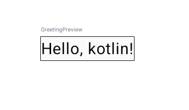
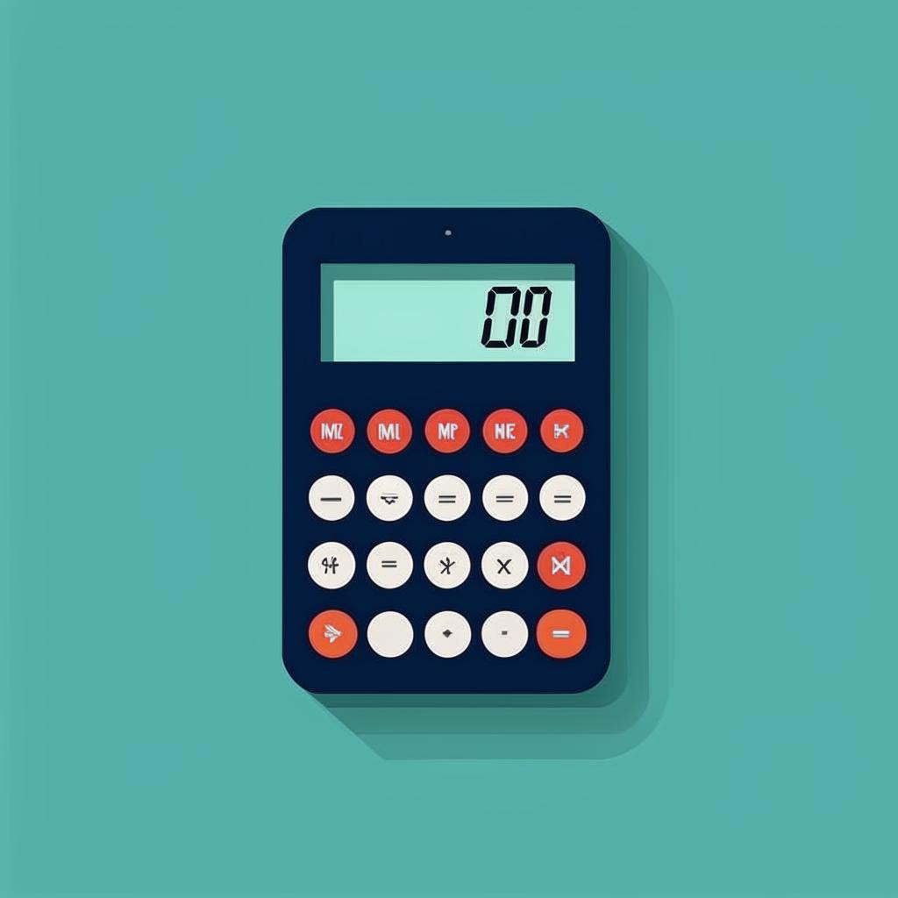
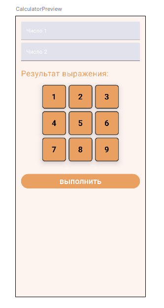

# Продолжаем изучение разработки мобильных приложений под ос Android.


## Раздел 2 урок 2 Jetpack Compose Основы Composable Функций


## Введение в Composable Функции

*   **Composable**: Это аннотация, которая обозначает функцию как часть UI в Jetpack Compose. Composable функции описывают, как должно выглядеть пользовательское пространство.

**Основы Создания Composable**

*   **Создание Composable функции:**

  
 

kotlin

```kotlin
@Composable fun Calculator() {
    // Тело функции, что она выполняет
    }
```

  
 

Использование Composable функций

*   **Вызов Composable функции:**

  
 

kotlin

```kotlin
setContent {
    Calculator()
}
```

## 1. Компоненты
Все UI-элементы создаются через функции, помеченные аннотацией @Composable.

```kotlin
@Composable
fun Greeting(name: String) {
    Text(text = "Hello, $name!")
}
```

## 2. Основные элементы UI



### Text
```kotlin
Text(
    text = "Welcome to Jetpack Compose!",
    color = Color.Blue,
    fontSize = 18.sp,
    fontWeight = FontWeight.Bold
)
```
## Button


```kotlin
Button(onClick = { /* Событие нажатия */ }) {
    Text("Нажми на меня")
}
```
## Image


```kotlin
Image(
            painter = painterResource(id = R.drawable.ic_launcher_foreground),
            contentDescription = "Example image",
            modifier = Modifier.size(100.dp)
        )
```

## TextField


```kotlin
 var text by remember { mutableStateOf("") }
        TextField(
            value = text,
            onValueChange = { text = it },
            label = { Text("Введите текст") }
        )

```


**Модификаторы в Compose**

*   **Модификаторы** используются для изменения внешнего вида или поведения Composable функций. 

*  padding(), margin() — отступы.
*  background() — фоновый цвет или изображение.
*  clickable() — обработка нажатий.
*  fillMaxSize(), wrapContentSize() — размер компонента.


**Вот несколько основных:**
    
      

    
*   **Padding** для добавления отступов:
    
      
     
    
    kotlin
    
    ```kotlin
    Modifier.padding(16.dp)
    ```
    
      
     
    
    *   **Size** для установки размера:
    
      
     
    
    kotlin
    
    ```kotlin
    Modifier.size(150.dp)
    ```
    
      
     
    
    *   **Background** для задания фона:
    
      
     
    
    kotlin
    
    ```kotlin
    Modifier.background(Color.LightGray)
    ```
    

**Пример Composable Функции**



**В данном разделе разберем на примере создания приложения "Калькулятор":**



**Код приложения:**

<details><summary><a href="https://developer.android.com/codelabs/jetpack-compose-basics">jetpack-compose-basics</a></summary>

```kotlin

package com.androidlesson.calculator

import android.os.Bundle
import androidx.activity.ComponentActivity
import androidx.activity.compose.setContent
import androidx.compose.foundation.BorderStroke
import androidx.compose.foundation.background
import androidx.compose.foundation.layout.*
import androidx.compose.foundation.shape.RoundedCornerShape
import androidx.compose.foundation.text.KeyboardOptions
import androidx.compose.material3.*
import androidx.compose.runtime.*
import androidx.compose.ui.Modifier
import androidx.compose.ui.graphics.Color
import androidx.compose.ui.text.font.FontWeight
import androidx.compose.ui.tooling.preview.Preview
import androidx.compose.ui.unit.dp
import androidx.compose.ui.unit.sp
import com.androidlesson.calculator.ui.theme.CalculatorTheme
import androidx.compose.ui.text.input.KeyboardType
import androidx.compose.ui.focus.FocusRequester
import androidx.compose.ui.focus.focusRequester
import androidx.compose.ui.focus.onFocusChanged

/**
 * Главная активность, которая устанавливает содержимое экрана на Calculator composable.
 * @see <a href="https://developer.android.com/reference/android/app/Activity">Activity</a>
 */
class MainActivity : ComponentActivity() {
    /**
     * Вызывается при запуске активности. Устанавливает содержимое экрана на Calculator composable.
     * @param savedInstanceState Если активность перезапускается после предыдущего завершения, то этот Bundle содержит данные, которые она в последний раз предоставила в onSaveInstanceState(Bundle).
     * @see <a href="https://developer.android.com/reference/android/app/Activity#onCreate(android.os.Bundle)">onCreate</a>
     */
    override fun onCreate(savedInstanceState: Bundle?) {
        super.onCreate(savedInstanceState)
        setContent {
            // Устанавливаем тему и содержимое приложения
            CalculatorTheme {
                Calculator()
            }
        }
    }
}

/**
 * Composable функция, представляющая простой интерфейс калькулятора.
 * @see <a href="https://developer.android.com/jetpack/compose/composables">Composable</a>
 */
@Composable
fun Calculator() {
    // Переменные состояния для ввода чисел и результата
    var number1 by remember { mutableStateOf("") }
    var number2 by remember { mutableStateOf("") }
    var result by remember { mutableStateOf("") }
    var isNumber1Focused by remember { mutableStateOf(true) }

    val focusRequester1 = remember { FocusRequester() }
    val focusRequester2 = remember { FocusRequester() }

    // Колонка для размещения элементов интерфейса калькулятора
    Column(
        modifier = Modifier
            .fillMaxSize() // Заполняет всю доступную высоту и ширину
            .background(Color(0xFFFDF3EF)) // Устанавливаем цвет фона
            .padding(16.dp) // Добавляем отступы вокруг колонки
    ) {
        // Поле ввода для первого числа
        TextField(
            value = number1,
            onValueChange = { number1 = it },
            label = { Text("Число 1", color = Color.White) }, // Метка для поля ввода
            modifier = Modifier
                .fillMaxWidth() // Поле ввода занимает всю ширину родителя
                .padding(bottom = 8.dp) // Добавляем отступ снизу
                .focusRequester(focusRequester1)
                .onFocusChanged { isNumber1Focused = it.isFocused },
            keyboardOptions = KeyboardOptions.Default.copy(keyboardType = KeyboardType.Number) // Устанавливаем тип клавиатуры на числовой
        )
        // Поле ввода для второго числа
        TextField(
            value = number2,
            onValueChange = { number2 = it },
            label = { Text("Число 2", color = Color.White) }, // Метка для поля ввода
            modifier = Modifier
                .fillMaxWidth() // Поле ввода занимает всю ширину родителя
                .padding(bottom = 8.dp) // Добавляем отступ снизу
                .focusRequester(focusRequester2)
                .onFocusChanged { isNumber1Focused = !it.isFocused },
            keyboardOptions = KeyboardOptions.Default.copy(keyboardType = KeyboardType.Number) // Устанавливаем тип клавиатуры на числовой
        )
        // Текст, отображающий результат
        Text(
            text = "Результат выражения: $result",
            color = Color(0xFFEAA060),
            fontSize = 24.sp, // Устанавливаем размер шрифта
            modifier = Modifier
                .fillMaxWidth() // Текст занимает всю ширину родителя
                .padding(vertical = 16.dp) // Добавляем вертикальные отступы
        )
        // Ряд кнопок для ввода чисел
        Row(
            modifier = Modifier.fillMaxWidth(), // Заполняет всю ширину
            horizontalArrangement = Arrangement.SpaceEvenly // Равномерное распределение кнопок
        ) {
            Column {
                Row {
                    CalculatorButton(symbol = "1") { if (isNumber1Focused) number1 += "1" else number2 += "1" }
                    CalculatorButton(symbol = "2") { if (isNumber1Focused) number1 += "2" else number2 += "2" }
                    CalculatorButton(symbol = "3") { if (isNumber1Focused) number1 += "3" else number2 += "3" }
                }
                Row {
                    CalculatorButton(symbol = "4") { if (isNumber1Focused) number1 += "4" else number2 += "4" }
                    CalculatorButton(symbol = "5") { if (isNumber1Focused) number1 += "5" else number2 += "5" }
                    CalculatorButton(symbol = "6") { if (isNumber1Focused) number1 += "6" else number2 += "6" }
                }
                Row {
                    CalculatorButton(symbol = "7") { if (isNumber1Focused) number1 += "7" else number2 += "7" }
                    CalculatorButton(symbol = "8") { if (isNumber1Focused) number1 += "8" else number2 += "8" }
                    CalculatorButton(symbol = "9") { if (isNumber1Focused) number1 += "9" else number2 += "9" }
                }
            }
        }
        // Пробел для разделения элементов интерфейса
        Spacer(modifier = Modifier.height(32.dp)) // Добавляем пространство между элементами
        // Кнопка для выполнения операции сложения
        Button(
            onClick = {
                // Преобразуем строки ввода в целые числа и вычисляем результат
                val num1 = number1.toIntOrNull() ?: 0
                val num2 = number2.toIntOrNull() ?: 0
                result = (num1 + num2).toString() // Обновляем результат
            },
            modifier = Modifier.fillMaxWidth(), // Кнопка занимает всю ширину родителя
            colors = ButtonDefaults.buttonColors(containerColor = Color(0xFFEAA060)) // Устанавливаем цвет кнопки
        ) {
            Text("выполнить", fontSize = 24.sp) // Текст на кнопке
        }
    }
}

/**
 * Composable функция для кнопки калькулятора.
 * @param symbol Символ, отображаемый на кнопке.
 * @param onClick Действие, выполняемое при нажатии на кнопку.
 * @see <a href="https://developer.android.com/jetpack/compose/composables">Button</a>
 */
@Composable
fun CalculatorButton(symbol: String, onClick: () -> Unit) {
    Button(
        onClick = onClick,
        modifier = Modifier
            .size(80.dp) // Размер кнопки
            .padding(4.dp), // Отступы вокруг кнопки
        colors = ButtonDefaults.buttonColors(containerColor = Color(0xFFEAA060), contentColor = Color.Black), // Устанавливаем цвет кнопки
        shape = RoundedCornerShape(8.dp), // Устанавливаем форму кнопки
        border = BorderStroke(2.dp, Color.DarkGray), // Устанавливаем границу кнопки
        elevation = ButtonDefaults.elevatedButtonElevation(defaultElevation = 8.dp) // Устанавливаем тень кнопки
    ) {
        Text(
            text = symbol,
            fontSize = 24.sp, // Размер шрифта
            fontWeight = FontWeight.Bold // Жирный шрифт
        )
    }
}

/**
 * Функция предпросмотра для Calculator composable.
 * @see <a href="https://developer.android.com/develop/ui/compose/tooling/previews">Preview</a>
 */
@Preview(showBackground = true)
@Composable
fun CalculatorPreview() {
    CalculatorTheme {
        Calculator()
    }
}
```
</details>
**Объяснение:**

  
 

*   **remember и mutableStateOf** используются для управления состоянием result.

Compose поддерживает реактивность через управление состоянием.

**Работа с состоянием через remember и mutableStateOf:**


```kotlin 
@Composable
fun Counter() {
    var count by remember { mutableStateOf(0) }
    Button(onClick = { count++ }) {
        Text("Clicked $count times")
    }
}

```

*   **Column и Row** используются для организации UI элементов в вертикальные и горизонтальные линии.

### Column Колонка (вертикальная группа элементов ):


Элементы размещаются друг под другом.

Свойства:
* verticalArrangement — управление расстоянием между элементами (например, SpaceAround, Top).
* horizontalAlignment — выравнивание по горизонтали (например, CenterHorizontally, Start).


```kotlin
Column {
    Text("Элемент 1")
    Text("Элемент 2")
}

```

### Row Ряд (горизонтальная группа):


Элементы размещаются в строку.
Свойства:
* horizontalArrangement — управление расстоянием между элементами (например, SpaceEvenly, Start).
* verticalAlignment — выравнивание по вертикали (например, CenterVertically, Top).


```kotlin
Row {
    Text("Слева")
    Spacer(modifier = Modifier.width(8.dp))
    Text("Справа")
}


```

*   **Modifier** применяется для настройки внешнего вида и расположения элементов.


**Практическое задание:**


*  Добавьте к калькулятору функциональность других операций. 

*  Вместо одной кнопки с результатом реализующей сложение, добавить кнопки для других операций. 

*  Выводить кнопки наа свое усмотрение добавить отдельной строкой к кнопкам или ниже отдельными кнопками.

*  Поменять визуальное оформление на собственный стиль.
