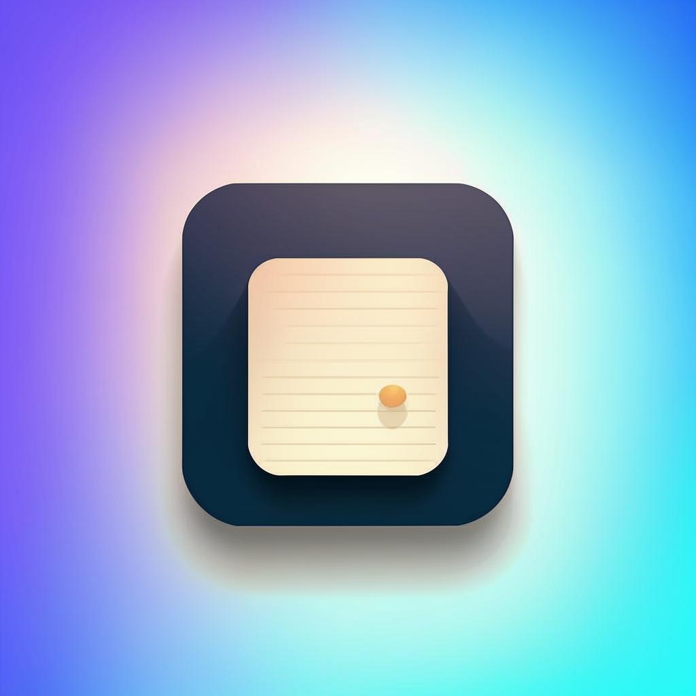
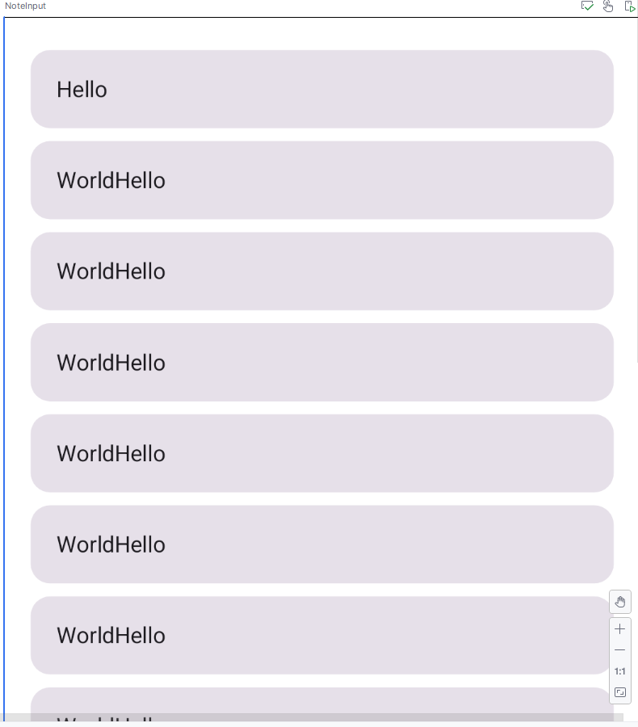
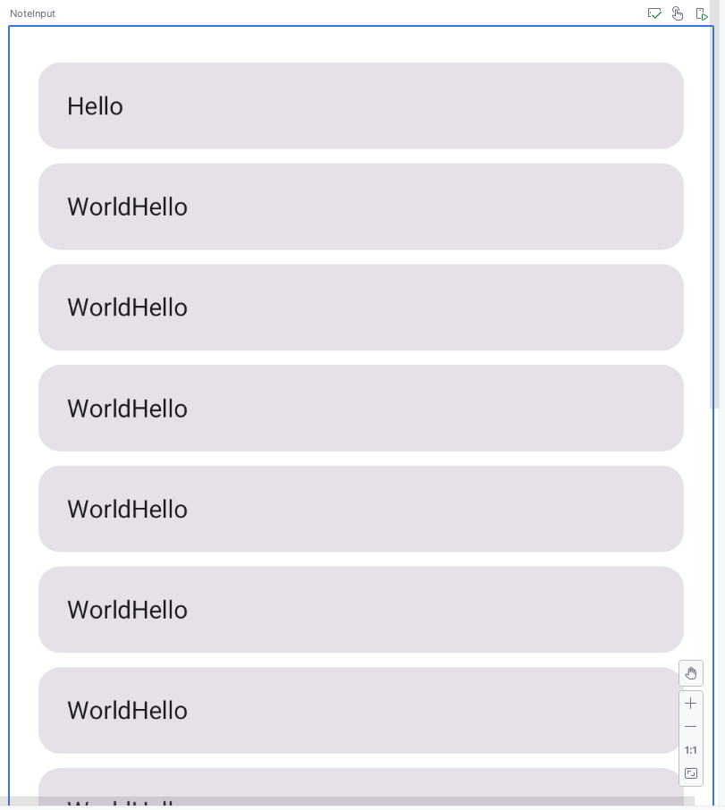
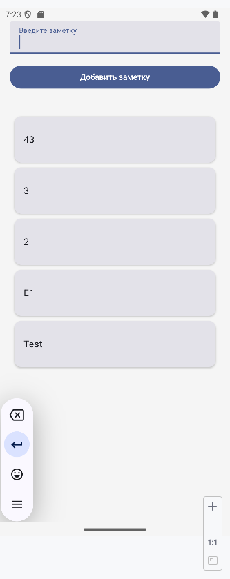
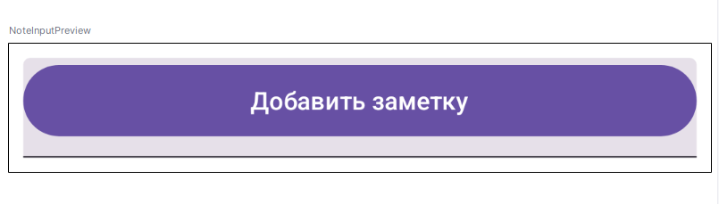

# Продолжаем изучение разработки мобильных приложений под ос Android.

## Раздел 2 урок 3 Jetpack Compose  Ввод и Вывод Данных

Для ввода текста в приложении предназначен компонент TextField. Он имеет несколько версий.
<details><summary><a href="https://metanit.com/kotlin/jetpack/4.3.php">TextField</a></summary>

```kotlin 
@Composable
fun TextField(
    value: String,
    onValueChange: (String) -> Unit,
    modifier: Modifier = Modifier,
    enabled: Boolean = true,
    readOnly: Boolean = false,
    textStyle: TextStyle = LocalTextStyle.current,
    label: (@Composable () -> Unit)? = null,
    placeholder: (@Composable () -> Unit)? = null,
    leadingIcon: (@Composable () -> Unit)? = null,
    trailingIcon: (@Composable () -> Unit)? = null,
    prefix: (@Composable () -> Unit)? = null,
    suffix: (@Composable () -> Unit)? = null,
    supportingText: (@Composable () -> Unit)? = null,
    isError: Boolean = false,
    visualTransformation: VisualTransformation = VisualTransformation.None,
    keyboardOptions: KeyboardOptions = KeyboardOptions.Default,
    keyboardActions: KeyboardActions = KeyboardActions.Default,
    singleLine: Boolean = false,
    maxLines: Int = if (singleLine) 1 else Int.MAX_VALUE,
    minLines: Int = 1,
    interactionSource: MutableInteractionSource? = null,
    shape: Shape = TextFieldDefaults.shape,
    colors: TextFieldColors = TextFieldDefaults.colors()
): Unit

```

</details>



1.  **TextField:**
    *   Используется для ввода текста пользователем.
    *   Свойства:
        *   ```value```: Текущее значение текста в поле.
        *   ```onValueChange```: Обратный вызов, который срабатывает при изменении текста.
        *   ```label```: Подсказка для пользователя о том, что нужно ввести.
        *   ```keyboardOptions```: Настройки отображения клавиатуры (например, KeyboardType.Number для числовой клавиатуры).
        *   ```modifier```: Используется для настройки внешнего вида, положения, размера и т.д.

```kotlin
@Composable
fun NotesList(notes: List<String>) {
    LazyColumn(
        modifier = Modifier
            .fillMaxSize()
            .padding(16.dp)
    ) {
        items(notes) { note ->
            NoteItem(note = note)
        }
    }
}

@Composable
fun NoteItem(note: String) {
    Card(
        modifier = Modifier
            .fillMaxWidth(1f )
            .padding(vertical = 4.dp),
    ) {
        Text(
            text = note,
            modifier = Modifier.padding(16.dp),
            maxLines = 3,
            overflow = TextOverflow.Ellipsis
        )
    }
}

@Preview
@Composable
fun NoteInput() {
    NotesList("Hello World".repeat(10).split(" "))
}
```


2.  **Button:**
    *   Для выполнения действий на основе ввода.
    *   Свойства:
        *   ```onClick```: Действие, которое выполняется при нажатии на кнопку.
        *   ```modifier```: Настройка внешнего вида кнопки.

  
 

**Вывод данных:**

  
 

1.  **LazyColumn / LazyRow:**
    *   Используются для отображения больших списков или сеток элементов с оптимизацией производительности.
    *   Свойства:
        *   ```items```: Функция, которая принимает коллекцию элементов для отображения.
        *   ```modifier```: Для управления размером, позиционированием и т.д.




```kotlin
@Composable
fun NotesList(notes: List<String>) {
    LazyColumn(
        modifier = Modifier
            .fillMaxSize()
            .padding(16.dp)
    ) {
        items(notes) { note ->
            NoteItem(note = note)
        }
    }
}

@Composable
fun NoteItem(note: String) {
    Card(
        modifier = Modifier
            .fillMaxWidth()
            .padding(vertical = 4.dp),
    ) {
        Text(
            text = note,
            modifier = Modifier.padding(16.dp),
            maxLines = 3,
            overflow = TextOverflow.Ellipsis
        )
    }
}


@Preview
@Composable
fun NoteInput() {
    NotesList("Hello World".repeat(10).split(" "))
}
```

2.  **Text:**
    *   Для отображения текста на экране.
    *   Свойства:
        *   ```text```: Текст для отображения.
        *   ```modifier```: Настройки текста, такие как размер, цвет, шрифт и т.д.
        *   ```maxLines```, ```overflow```: Для управления количеством строк и поведением при переполнении текста.

**Состояние:**

  
 

*   **remember**: Используется для сохранения состояния между рекомпозициями UI.
*   **mutableStateOf**: Создает изменяемое состояние, которое может вызвать рекомпозицию при изменении.

  
 

**Взаимодействие:**

  
 

*   **onClick**: Обработчик нажатий на элементы, такие как кнопки.
*   **pointerInput**: Используется для обработки жестов, например, долгого нажатия.        


**Практическая часть, приложение заметок.**




<details><summary><a href="https://developer.android.com/codelabs/jetpack-compose-state">Приложение заметок</a></summary>

```kotlin

package com.androidlesson.notes

import android.os.Bundle
import androidx.activity.ComponentActivity
import androidx.activity.compose.setContent
import androidx.activity.enableEdgeToEdge
import androidx.compose.animation.animateColorAsState
import androidx.compose.foundation.background
import androidx.compose.foundation.gestures.detectTapGestures
import androidx.compose.foundation.layout.Column
import androidx.compose.foundation.layout.Row
import androidx.compose.foundation.layout.Spacer
import androidx.compose.foundation.layout.fillMaxSize
import androidx.compose.foundation.layout.fillMaxWidth
import androidx.compose.foundation.layout.height
import androidx.compose.foundation.layout.padding
import androidx.compose.foundation.lazy.LazyColumn
import androidx.compose.foundation.lazy.itemsIndexed
import androidx.compose.foundation.text.KeyboardOptions
import androidx.compose.material.icons.Icons
import androidx.compose.material.icons.filled.Delete
import androidx.compose.material3.Button
import androidx.compose.material3.Card
import androidx.compose.material3.CardDefaults
import androidx.compose.material3.Icon
import androidx.compose.material3.IconButton
import androidx.compose.material3.Text
import androidx.compose.material3.TextField
import androidx.compose.runtime.Composable
import androidx.compose.runtime.getValue
import androidx.compose.runtime.mutableStateListOf
import androidx.compose.runtime.mutableStateOf
import androidx.compose.runtime.remember
import androidx.compose.runtime.setValue
import androidx.compose.ui.Alignment
import androidx.compose.ui.Modifier
import androidx.compose.ui.draw.alpha
import androidx.compose.ui.graphics.Color
import androidx.compose.ui.input.pointer.pointerInput
import androidx.compose.ui.text.input.KeyboardType
import androidx.compose.ui.text.style.TextOverflow
import androidx.compose.ui.tooling.preview.Preview
import androidx.compose.ui.unit.dp
import com.androidlesson.notes.ui.theme.NotesTheme

class MainActivity : ComponentActivity() {
    override fun onCreate(savedInstanceState: Bundle?) {
        super.onCreate(savedInstanceState)
        enableEdgeToEdge()
        setContent {
            NotesTheme {
                NotesApp()
            }
        }
    }
}

@Composable
fun NotesApp() {
    // Создаем список заметок, который будет хранить все добавленные заметки
    val notes = remember { mutableStateListOf<String>() }

    Column(
        modifier = Modifier
            .fillMaxSize()
            .background(Color(0xFFF5F5F5)) // Устанавливаем фоновый цвет
            .padding(16.dp) // Добавляем отступы
    ) {
        // Ввод заметки и добавление ее в список
        NoteInput(onNoteAdded = { note: String -> notes.add(0, note) })
        Spacer(modifier = Modifier.height(16.dp)) // Добавляем вертикальный отступ
        // Отображаем список заметок
        NotesList(notes = notes)
    }
}

@Composable
fun NotesList(notes: MutableList<String>) {
    LazyColumn(
        modifier = Modifier
            .fillMaxSize()
            .padding(16.dp) // Добавляем отступы
    ) {
        // Проходим по списку заметок и отображаем каждую заметку
        itemsIndexed(notes) { index, note ->
            NoteItem(note = note) {
                notes.removeAt(index) // Удаляем заметку при нажатии на иконку удаления
            }
        }
    }
}

@Composable
fun NoteItem(note: String, onDelete: () -> Unit) {
    var showDeleteIcon by remember { mutableStateOf(false) }
    // Анимируем цвет фона при долгом нажатии
    val animatedColor by animateColorAsState(
        targetValue = if (showDeleteIcon) Color.Red.copy(alpha = 0.1f) else Color.Transparent,
        label = ""
    )
    Card(
        modifier = Modifier
            .fillMaxWidth()
            .background(animatedColor)
            .padding(vertical = 4.dp)
            .pointerInput(Unit) {
                detectTapGestures(
                    onLongPress = { showDeleteIcon = true } // Показываем иконку удаления при долгом нажатии
                )
            },
        elevation = CardDefaults.cardElevation(defaultElevation = 2.dp)
    ) {
        Row(
            modifier = Modifier.padding(16.dp),
            verticalAlignment = Alignment.CenterVertically
        ) {
            // Отображаем текст заметки
            Text(
                text = note,
                maxLines = 3,
                overflow = TextOverflow.Ellipsis,
                modifier = Modifier.weight(1f)
            )
            // Иконка удаления заметки
            IconButton(
                onClick = onDelete,
                modifier = Modifier.alpha(if (showDeleteIcon) 1f else 0f) // Прозрачность иконки
            ) {
                Icon(Icons.Default.Delete, contentDescription = "Удалить")
            }
        }
    }
}

@Preview
@Composable
fun NoteInputPreview() {
    NoteInput(onNoteAdded = {})
}

@Composable
fun NoteInput(onNoteAdded: (String) -> Unit) {
    // Создаем состояние для текста заметки
    val noteText = remember { mutableStateOf("") }

    TextField(
        value = noteText.value,
        onValueChange = { noteText.value = it }, // Обновляем текст заметки при вводе
        label = { NoteLabel() }, // Метка для поля ввода
        modifier = Modifier
            .fillMaxWidth()
            .padding(8.dp), // Добавляем отступы
        keyboardOptions = KeyboardOptions(keyboardType = KeyboardType.Text) // Настройки клавиатуры
    )
    Button(
        onClick = {
            if (noteText.value.isNotBlank()) {
                onNoteAdded(noteText.value) // Добавляем заметку
                noteText.value = "" // Очищаем поле ввода после добавления заметки
            }
        },
        modifier = Modifier
            .padding(8.dp)
            .fillMaxWidth()
    ) {
        Text("Добавить заметку")
    }
}

@Composable
fun NoteLabel() {
    Text("Введите заметку")
}
```
</details>



## Объяснение:
*   mutableStateListOf используется для создания изменяемого списка заметок, который будет автоматически обновлять UI при изменении cостояние, например добавления заметок/удаления или редактирования.
*   NoteInput компонент обрабатывает ввод пользователя и добавляет новую заметку в список.
*   NotesList отображает все заметки, используя LazyColumn для эффективного рендеринга больших списков.

**Практическое задание:**

* Добавьте возможность изменения заметок
* Добавить подтверждение удаления:  Перед удалением заметки показывать подтверждение удаления.