# Продолжаем изучение разработки мобильных приложений под ос Android.

## Раздел 2 урок 4 Jetpack Compose Макеты Layouts

**Основные макеты**

*  Column: Используется для вертикального расположения элементов.
*  Row: Для горизонтального расположения.
*  Box: Контейнер для наложения элементов друг на друга или для создания пространства.

# 📐 Расположение элементов (Layout)

Compose предоставляет мощные инструменты для верстки, позволяя компоновать элементы вертикально, горизонтально или накладывать их друг на друга.

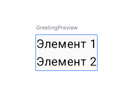

## Column Колонка (вертикальная группа элементов ):

Элементы размещаются друг под другом.

Свойства:
* verticalArrangement — управление расстоянием между элементами (например, SpaceAround, Top).
* horizontalAlignment — выравнивание по горизонтали (например, CenterHorizontally, Start).


```kotlin
Column {
    Text("Элемент 1")
    Text("Элемент 2")
}

```


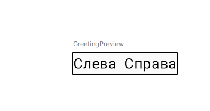

## Row Ряд (горизонтальная группа):
Элементы размещаются в строку.
Свойства:
* horizontalArrangement — управление расстоянием между элементами (например, SpaceEvenly, Start).
* verticalAlignment — выравнивание по вертикали (например, CenterVertically, Top).


```kotlin
Row {
    Text("Слева")
    Spacer(modifier = Modifier.width(8.dp))
    Text("Справа")
}


```

## Box коробка (накладывающиеся элементы):


Элементы накладываются друг на друга.

Свойства:
* contentAlignment — задает выравнивание вложенных элементов.
* Используй модификаторы align(Alignment) для индивидуального выравнивания. weight - распределение пространства между элементами.

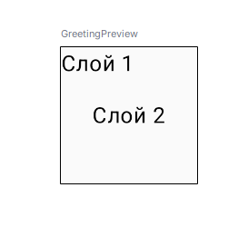

```kotlin

Box(modifier = Modifier.size(100.dp)) {
    Text("Слой 1", modifier = Modifier.align(Alignment.TopStart))
    Text("Слой 2", modifier = Modifier.align(Alignment.Center))
}

```

**Пример использования weight:**

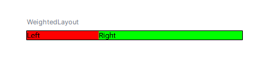

```kotlin
@Composable
fun WeightedLayout() {
    Row(modifier = Modifier.fillMaxWidth()) {
        // Элемент занимает 1 часть пространства
        Text("Left", Modifier.weight(1f).background(Color.Red))
        // Элемент занимает 2 части пространства
        Text("Right", Modifier.weight(2f).background(Color.Green))
    }
}
```

**Пример использования наложения в Box**

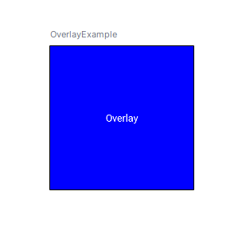

```kotlin
@Composable
fun OverlayExample() {
    Box(
        modifier = Modifier
            .size(200.dp)
            .background(Color.Blue)
    ) {
        Text(
            text = "Overlay",
            color = Color.White,
            modifier = Modifier.align(Alignment.Center)
        )
    }
}```

**fillMaxSize c вложенными макетами:**

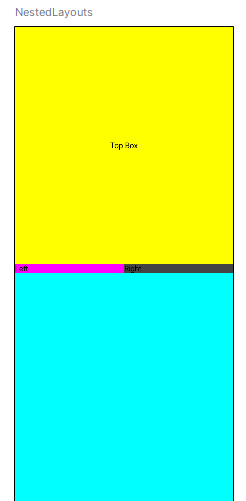

```kotlin @Preview(showBackground = true)
@Composable
fun NestedLayouts() {
    Column(
        modifier = Modifier
            .fillMaxSize()
            .background(Color.Gray)
    ) {
        Box(
            modifier = Modifier
                .weight(1f)
                .fillMaxWidth()
                .background(Color.Yellow)
        ) {
            Text("Top Box", Modifier.align(Alignment.Center))
        }
        Row(
            modifier = Modifier
                .weight(1f)
                .fillMaxWidth()
                .background(Color.Cyan)
        ) {
            Text("Left", Modifier.weight(1f).background(Color.Magenta))
            Text("Right", Modifier.weight(1f).background(Color.DarkGray))
        }
    }
}```

## LazyColumn (список) 

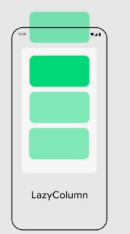

Для работы с длинными списками или динамическими данными.
Свойства:
* items() — генерирует элементы из списка или диапазона.
* verticalArrangement — расстояние между элементами.

```kotlin
@Composable
fun LazyColumnExample() {
    LazyColumn(
        modifier = Modifier.fillMaxSize(),
        verticalArrangement = Arrangement.spacedBy(8.dp)
    ) {
        items(50) { index ->
            Text("Item $index", modifier = Modifier.padding(8.dp))
        }
    }
}
```
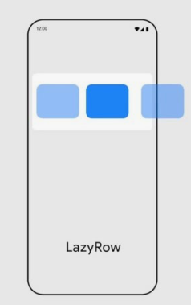

## LazyRow (горизонтальный список)

Свойства:
* items() — генерирует элементы из списка или диапазона.
* horizontalArrangement  — расстояние между элементами.

```kotlin 
@Composable
fun LazyRowExample() {
    LazyRow(
        modifier = Modifier.fillMaxWidth(),
        horizontalArrangement = Arrangement.spacedBy(8.dp)
    ) {
        items(50) { index ->
            Text("Item $index", modifier = Modifier.padding(8.dp))
        }
    }
}
```
## Spacer (разделитель пространства)

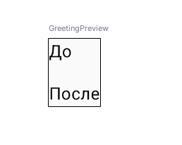

```kotlin
@Composable
fun SpacerExample() {
    Column {
        Text("До")
        Spacer(modifier = Modifier.height(16.dp))
        Text("После")
    }
}
```

## ConstraintLayout (сложная компоновка)
Для более сложных схем.


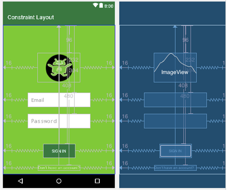

```kotlin
@Composable
fun ConstraintLayoutExample() {
    ConstraintLayout(
        modifier = Modifier.fillMaxSize()
    ) {
        val (text1, text2, button) = createRefs()

        Text(
            "Hello",
            modifier = Modifier.constrainAs(text1) {
                top.linkTo(parent.top)
                start.linkTo(parent.start)
            }
        )
        Text(
            "World",
            modifier = Modifier.constrainAs(text2) {
                top.linkTo(text1.bottom)
                start.linkTo(text1.end)
            }
        )
        Button(
            onClick = { },
            modifier = Modifier.constrainAs(button) {
                bottom.linkTo(parent.bottom)
                end.linkTo(parent.end)
            }
        ) {
            Text("Click me")
        }
    }
}

```

# В качестве практического знакомство с компонентами разметки реализуем пример вывода изображений в галерее. 

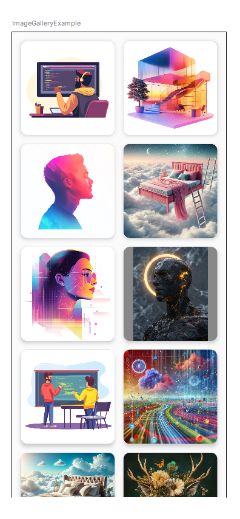

**Код приложения**

<details><summary><a href="https://developer.android.com/develop/ui/compose/layouts">Приложение галерея</a></summary>


```kotlin
package com.androidlesson.imagegallery

import android.os.Bundle
import androidx.activity.ComponentActivity
import androidx.activity.compose.setContent
import androidx.activity.enableEdgeToEdge
import androidx.compose.foundation.Image
import androidx.compose.foundation.background
import androidx.compose.foundation.layout.Arrangement
import androidx.compose.foundation.layout.Box
import androidx.compose.foundation.layout.Column
import androidx.compose.foundation.layout.PaddingValues
import androidx.compose.foundation.layout.Row
import androidx.compose.foundation.layout.aspectRatio
import androidx.compose.foundation.layout.fillMaxSize
import androidx.compose.foundation.layout.fillMaxWidth
import androidx.compose.foundation.layout.padding
import androidx.compose.foundation.layout.size
import androidx.compose.foundation.lazy.grid.GridCells
import androidx.compose.foundation.lazy.grid.LazyVerticalGrid
import androidx.compose.material3.Card
import androidx.compose.material3.CardDefaults
import androidx.compose.material3.Scaffold
import androidx.compose.material3.Text
import androidx.compose.runtime.Composable
import androidx.compose.ui.Alignment
import androidx.compose.ui.Modifier
import androidx.compose.ui.graphics.Color
import androidx.compose.ui.res.painterResource
import androidx.compose.ui.tooling.preview.Preview
import androidx.compose.ui.unit.dp
import com.androidlesson.imagegallery.ui.theme.ImageGalleryTheme

class MainActivity : ComponentActivity() {
    override fun onCreate(savedInstanceState: Bundle?) {
        super.onCreate(savedInstanceState)
        enableEdgeToEdge()
        setContent {
            ImageGalleryTheme {
                ImageGallery()
            }
        }
    }
}

// Список идентификаторов ресурсов изображений
val imageResIds = listOf(
    R.drawable.image0,
    R.drawable.image1,
    R.drawable.image2,
    R.drawable.image3,
    R.drawable.image4,
    R.drawable.image5,
    R.drawable.image6,
    R.drawable.image7,
    R.drawable.image8,
    R.drawable.image9,
    // Добавьте все используемые изображения сюда (img/image10, image11, ... не забудьте перед этим добавить их в папку res/drawable
)

@Composable
fun ImageGallery() {
    // Создание сетки изображений
    LazyVerticalGrid(
        columns = GridCells.Fixed(2), // Установка двух колонок
        contentPadding = PaddingValues(8.dp), // Отступы вокруг содержимого
        modifier = Modifier.fillMaxSize() // Заполнение всего доступного пространства
    ) {
        // Отображение каждого изображения из списка
        items(img/imageResIds.size) { index ->
            ImageCard(img/imageResIds[index])
        }
    }
}

@Composable
fun ImageCard(img/imageResId: Int) {
    // Карточка для отображения изображения
    Card(
        modifier = Modifier
            .padding(8.dp) // Отступы вокруг карточки
            .aspectRatio(1f), // Соотношение сторон 1:1
        elevation = CardDefaults.cardElevation(defaultElevation = 4.dp) // Высота тени
    ) {
        Box(
            modifier = Modifier
                .background(Color.Gray) // Фон серого цвета
                .fillMaxSize(), // Заполнение всего доступного пространства
            contentAlignment = Alignment.Center // Центрирование содержимого
        ) {
            // Отображение изображения
            Image(
                painter = painterResource(id = imageResId),
                contentDescription = "Image $imageResId" // Описание изображения
            )
        }
    }
}

@Preview(showBackground = true)
@Composable
fun ImageGalleryExample() {
    // Пример предварительного просмотра галереи изображений
    ImageGalleryTheme {
        ImageGallery()
    }
}
```
</details>


**Объяснение:**

  LazyVerticalGrid(
        columns = GridCells.Fixed(2), // Установка двух колонок
        contentPadding = PaddingValues(8.dp), // Отступы вокруг содержимого
        modifier = Modifier.fillMaxSize() // Заполнение всего доступного пространства
    ) {}
 *  LazyVerticalGrid используется для создания сетки изображений, что эффективно для большого количества элементов.

.aspectRatio(1f), // Соотношение сторон 1:1
 *  aspectRatio задает соотношение сторон карточки, чтобы изображения были квадратными.

 *  Модификаторы padding и elevation помогают с визуальным восприятием.

**Используемые изображения приложены в папке android image**

  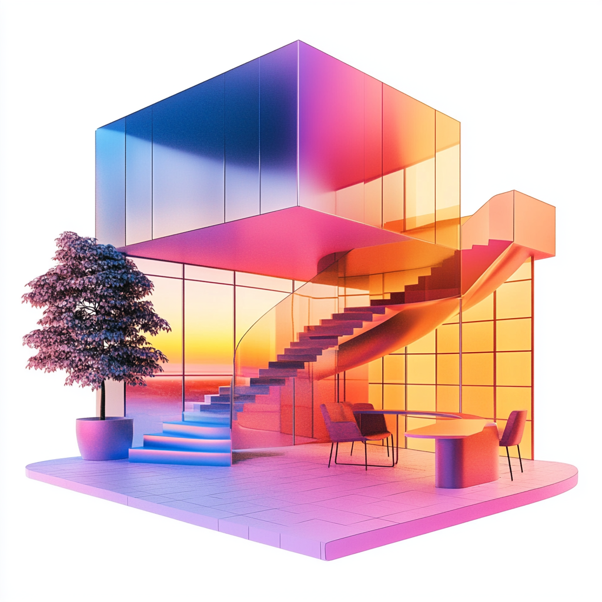 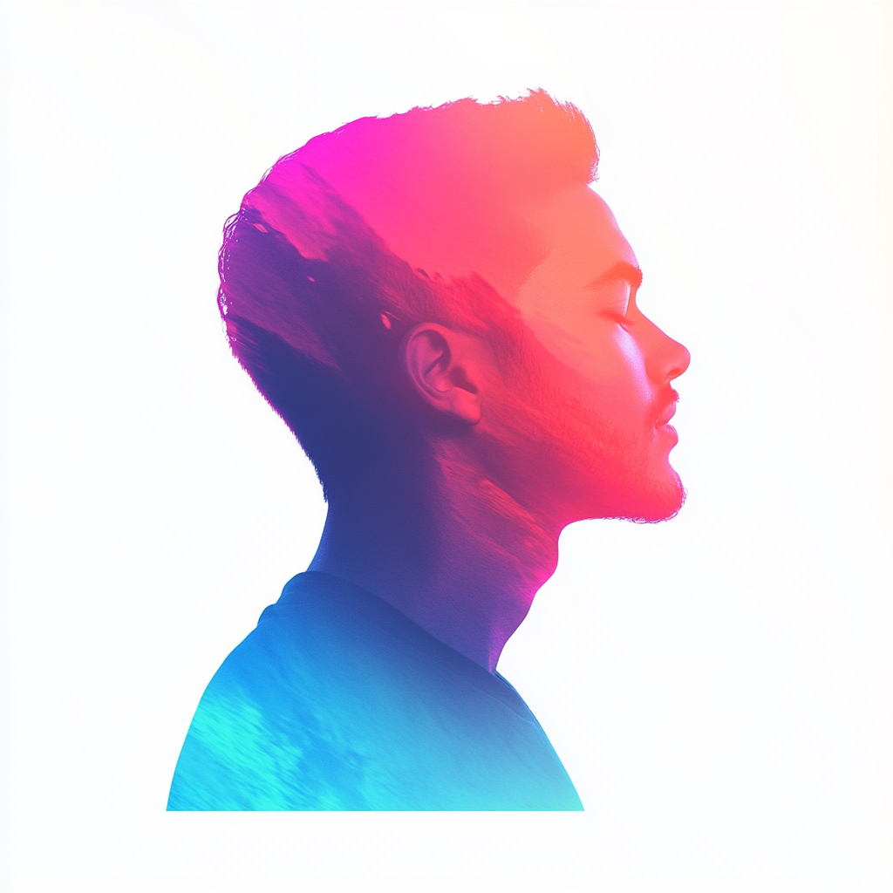      


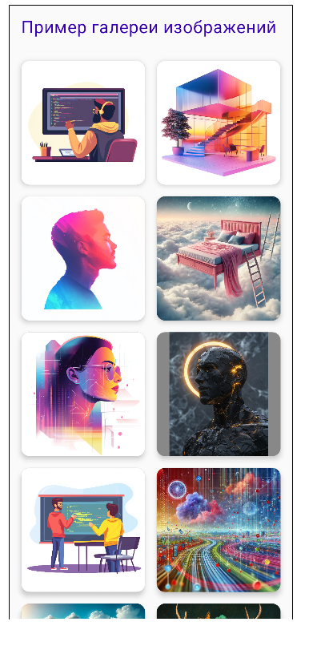

**Практическое задание**

* Добавьте заголовок "С названием приложения" название по своему желанию.

* Добавьте событие для карточки на изменение состояние по нажатию, например анимация или изменение цвета фона.

**Подсказка, для корректного вывода названия без наложения используйте элементы layouts.**