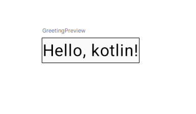

# Продолжаем изучение разработки мобильных приложегий под ос Android.

# Раздел 2 урок 1 Введение в Android разработку

## Для начала создадим новое приложение:

**На старте выбираем новый проект**


* Далее шаблон Empty Activity  

* Название приложения

* Название для публикации

* Папка где будет расположен проект

* Язык оставляем kotlin

* Minimum SDK желательно соответсвующий версии Android вашего телефона или Android 10 и выше, по умолчанию предлагает API 28 но Google уже сейчас рекомендует выбирать API 29 Android 10 и выше.*


### Если есть вопросы обратитесь к разделу первое приложение.

 Пройдет создание вашего первого Android приложения, после запуска мы видим проект


**Главный файл**

*   **MainActivity.kt:**

  
 
<details><summary><a href="https://developer.android.com/develop/ui/compose/setup">Первое приложение</a></summary>

kotlin

```kotlin
package com.androidlesson.first

import android.os.Bundle
import androidx.activity.ComponentActivity
import androidx.activity.compose.setContent
import androidx.activity.enableEdgeToEdge
import androidx.compose.foundation.layout.fillMaxSize
import androidx.compose.foundation.layout.padding
import androidx.compose.material3.Scaffold
import androidx.compose.material3.Text
import androidx.compose.runtime.Composable
import androidx.compose.ui.Modifier
import androidx.compose.ui.tooling.preview.Preview
import com.androidlesson.first.ui.theme.FirstTheme

// Главная активность приложения
class MainActivity : ComponentActivity() {
    // Метод, вызываемый при создании активности
    override fun onCreate(savedInstanceState: Bundle?) {
        super.onCreate(savedInstanceState)
        // Включение режима Edge-to-Edge вывод от края до края
        enableEdgeToEdge()
        // Установка содержимого активности
        setContent {
            // Применение нашей темы, соответсвует названию приложения с добавлением слова тема FirstTheme
            FirstTheme {
                // Использование Scaffold для создания базовой структуры экрана
                Scaffold(modifier = Modifier.fillMaxSize()) { innerPadding ->
                    // Вызов функции Greeting с передачей имени и отступов
                    Greeting(
                        name = "Android",
                        modifier = Modifier.padding(innerPadding)
                    )
                }
            }
        }
    }
}

// Компонент Compose, отображающий приветственное сообщение
@Composable
fun Greeting(name: String, modifier: Modifier = Modifier) {
    // Текстовый элемент, отображающий приветствие
    Text(
        text = "Hello $name!",
        modifier = modifier
    )
}

// Предпросмотр компонента Greeting в Android Studio
@Preview(showBackground = true)
@Composable
fun GreetingPreview() {
    // Применение темы
    FirstTheme {
        // Вызов функции Greeting с передачей имени
        Greeting("Android")
    }
}
```

</details>
 

**Объяснение:**

  
 

*   **setContent**: Это где начинается описание UI с помощью Compose.
*   **Composable**: Аннотация, обозначающая функцию, которая может быть использована для построения UI.
*   **FirstTheme**: Вызов темы для применения стилей к UI.
*   **Scaffold**: Используется для создания контейнера с фоном.
*   **Text**: Элемент для отображения текста.
*   @**Preview**: Аннотация для создания превью UI в Android Studio.


**Запуск и тестирование**


*   **Запуск приложения:**
    *   Выберите виртуальное устройство или подключите физическое устройство и нажмите "Run" в Android Studio.


**Пример вывода превью**


 **Просмотр превью:**

Перейдите в режим "Design" для MainActivity.kt, чтобы увидеть, как будет выглядеть ваш UI.




**Наше приложение до модификации**

**Самостоятельная работа:**
* Измените текст приветствия на "Hello, i learn Android!", 

* Измените цвет текста на свое усмотрение 

* Добавьте отступы вокруг текста для визуального улучшения.


**В превью.**


**В эмуляторе.**

**Приложение после доработок**

**Подсказка:**
 для этого используется элемент jetpack compose Text и его свойства.


### Text
```kotlin
Text(
    text = "Welcome to Jetpack Compose!",
    color = Color.Blue, //Цвет текста так же кроме стандартных можно использовать заготовленные цвета темы или HEX RGB Пример: color = Color(0xFFD0BCFF)
    fontSize = 18.sp, //Размер текста
    fontWeight = FontWeight.Bold // Вес текста
)
```


**Ошибки в коде.**

Бывают случаи когда выводится красным или желтым ошибка в данном случае Android studio жалуется на импорт элемента, для решения таких проблем попробуйте нажать правую кнопку по ошибку и предупреждению и выбрать пункт Show Context Actions он покажет варианты решения. 

**Например в нашем случае нужен банальный импорт.**


**Так же можно выбрать решение конфликта через комбинацию клавиш alt+Enter**


